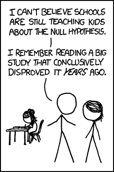

<!-- The code on lines 9-11 below converts the - into a, b, etc. -->
<style type="text/css">
    ul { list-style-type: lower-alpha; }
</style>

* * *

#### Multiple Choice Questions}

Select the best **choice**.  Please bold your answer by added two astericks before and after your choice.


1. The scores of individual students on the American College Testing (ACT) Program composite college entrance examination have a normal distribution with mean that varies slightly from year to year and standard deviation 6.0. You plan to take an SRS of size $n$ of the students who took the ACT exam this year and compute the mean score of the students in your sample. You will use this to estimate the mean score of all students this year. In order for the standard error to be no more than 0.1 on average, how large should $n$ be?

    - at least 60
    - at least 360
    - at least 3600
    - This cannot be determined because we do not know the true mean of the population
  
  
2. Which of the following statements is true according to the Central Limit Theorem?
  
    - An increase in sample size from $n=16$ to $n=25$ will produce a sampling distribution with a larger standard deviation.
    - When sampling from the same population, the center of the sampling distribution of sample means when $n=16$ will be the same as the center of the sampling distribution when $n=25$.
    - The center of a sampling distribution of sample means is equal to the population mean divided by the square root of the sample size.
    - The larger the sample size, the more the sampling distribution of sample means resembles the shape of the population.
  
  
3. Which of the following is NOT one of the conditions needed in the analysis of variance test?
  
    - The different populations all have the same mean.
    - The observations are independent of one another.
    - The distribution of the response variable is normal within each population.
    - The different populations all have the same standard deviation.
  


4. If the sample size for a poll increases from 100 people to 400 people, the margin of error roughly:
  
    - decreases by a factor of 2, i.e. is multiplied by 1/2
    - increases by a factor of 4, i.e. is multiplied by 4
    - increases by a factor of 2, i.e. is multiplied by 2
    - decreases by a factor of 4, i.e. is multiplied by 1/4
  


5. You have computed a 95% confidence interval for the mean, $\mu$, of a population as (13, 20). Based on this interval, you can say:
  
    - A null hypothesis that $\mu$ = 14 is not rejected at $\alpha$ = 5%.
    - A null hypothesis that $\mu$ = 24 is rejected at $\alpha$ = 5%.
    - Both (a) and (b) are true.
  
6. Using data from a random sample from a population, we construct both a 95% confidence interval and a 90% confidence interval for the population mean.  How will these intervals differ?
  
	  - The 90% interval will be wider than the 95% interval.
    - The 90% interval will not be as wide as the 95% interval. 
    - Which interval is wider will depend on how large the sample is.
	  - Which interval is wider will depend on whether the sample is unbiased.
	  - Which interval is wider will depend on whether $z$- or $t$-statistics are used to create the intervals.
  
7. What type of plot would you use to visualize the relationship between
  the weight of pizza (in grams) individual Reed students consumed over the 
  next week and class year (i.e. '16, '17, '18, '19)?
    
    - Stacked barchart
    - Histogram
    - Side-by-side boxplots
    - Density plot
  
  
8. A sampling distribution represents:
  
    - The distribution of the test statistic under hypothetical resampling.
    - The distribution of the data.
    - The hypothetical distribution of the population.
  
* * *

#### True or False?

9. Determine if each of the following statement is true or false. If false, suggest an alternative wording to make it a true statement.
  
    - When testing the null hypothesis that $p=0.9$ in a sample of size $n=50$, the normal approximation to the sampling distribution of $\hat{p}$ is reasonable, because $np > 10$. 

    - If your sample size is 74, then it is important to use the $T$ distribution instead of the normal.

    - The chi-square distribution, just like the normal distribution, has two parameters, mean and standard deviation.

    - The chi-square statistic is always positive.
    - As the degrees of freedom increases, the shape of the chi-square distribution becomes more skewed.


#### Identify the Problem Type

For the following questions, 

 - identify which type of problem it is:  One Proportion, Two Proportions, Multiple Proportions (Goodness of Fit), Multiple Proportions (Test of Independence), One Mean, Two Means (Independent), Two Means (Paired), or Multiple Means,
 - give the two competing hypotheses (in symbols as much as possible), and
 - name an appropriate visualization for the sample data corresponding to the problem set-up.

    
10. In the paper "Outcomes at School Age After Postnatal Dexamethasone
Therapy for Lung Disease of Prematurity," T. Yeh et al. studied the outcomes at
school age in children who had participated in a double-blind, placebo-controlled
trial of early postnatal dexamethasone therapy for the prevention of chronic lung
disease of prematurity. One result reported in the study was that the control
group of 74 randomly selected children had a mean IQ score of 84.4 with
standard deviation of 12.6, whereas the dexamethasone group of 72 randomly
selected children had a mean IQ score of 78.2 with a standard deviation of 15.0.
Do the data provide sufficient evidence to conclude that early postnatal
dexamethasone therapy has, on average, an effect on IQ?

* * *

11. A study was conducted in which 14 subjects drank 240 mL per
day of orange juice fortified with 1000 IU of vitamin D. Concentration levels were recorded
at the beginning of the experiment and again at the end of 12 weeks. Based on the results of the study, 
the average serum 25(OH)D concentration before the treatment was 37 nanometers/liter and after
the treatment was 94 nanometers/liter.  Do the data provide sufficient evidence to conclude that,
on average, drinking fortified orange juice changes the serum 25(OH)D concentration in the blood?

* * *

12. Iron is essential to most life forms and to normal human physiology. It is an
integral part of many proteins and enzymes that maintain good health. The
recommended dietary allowance (RDA) of iron for adult females under the age of
51 is 18 milligrams (mg) per day. A random sample of 45 adult females under the
age of 51 was selected with a corresponding sample mean RDA level of 14.68 mg
and sample standard deviation of 11.1 mg. Do the
data suggest that adult females under the age of 51 are, on average, not getting
the RDA of iron?

* * *

13. In a February 2013 Quinnipiac University poll the following question about a typical practice of
the New York Police Department was asked to a random sample of New York City voters. "As you may
know, there is a police practice known as stop and frisk, where police stop and question a person they
suspect of wrongdoing and, if necessary search that person. Do you approve or disapprove of this police
practice?" Of the 232 surveyed between 18-34 years old, 68 approved, of the 332 between 35-54 years old, 
128 approved, and of those 338 older than 55, 173 approved.  Does an association with age and whether
or not someone approves of stop and frisk exist? 

* * *

14. According to a recent study, taller women have a significantly higher risk of developing some form of cancer.
The American Cancer Society reports that approximately 38% of all women develop some form of cancer in their lifetime.
A long-term Canadian study was conducted involving 1250 tall women between the ages of 50 and 79, and 502 developed
some form of cancer.  Is there any evidence to suggest that the proportion of taller women who develop cancer
is at a higher or lower proportion than 38%?

* * *

15. The article "Foraging Behavior of the Indian False Vampire Bat" reported that
36 of 193 randomly selected female bats in flight spent more than 5 minutes in
the air before locating food. Out of 168 randomly selected male bats, 64 spent
more than 5 minutes in the air before locating food. Is there sufficient evidence
to conclude that the proportion of flights longer than 5 minutes in length differs
for males and females?

* * *

#### Short Answer Questions

16. An article in _Science_^[Did Merck's Failed HIV Vaccine
  Cause Harm?, v 318, November 16, 2007, p. 1048] that assessed the efficacy of
  an HIV vaccine reports that the study
  initially involved 1500 HIV negative subjects with low Ad5-antibody
  levels.  Subjects with high Ad5-antibody levels were excluded due to
  fears that the vaccine would not work in that group.  Later they
  decided to replicate the initial design with another 1500 subjects
  having high levels of Ad5-antibody.  The following is a quote from
  the report in _Science_.

> When the researchers subsequently examined the high-Ad5-antibody
group, they were startled to find 21 infections in the vaccine group
versus 9 in the placebo group.

> The statistical analysis is ambiguous. _Typically, researchers deem a
difference as significant if it has a 95% probability of not being
due to chance -- a $p$-value less than .05._  By these standards, the
finding, with a $p$-value of .029, was significant. But Steven Self,
HVTN's head statistician at the University of Washington, Seattle,
cautioned that this comparison merits a more stringent cutoff for
significance, between .025 and .0025, because the study was not
designed to assess potential harm, nor did the investigators plan to
evaluate a subset of the study population.


  - Is the interpretation of the $p$-value given in the italicized
  sentence correct?  Think through the wording very carefully and explain. It may
  be helpful to write out the definition of a $p$-value in probability notation.

  - The statistician states that the experiment and hypotheses were not designed to
  assess potential harm. Please write out the corresponding null and alternative hypotheses.
  
  - Based on a $p$-value of 0.029 and $\alpha = 0.04$, what decision did the researchers come to regarding
  the null hypothesis? What type of error could they have conceivably made and with what probability?

* * *

17. To understand the effect of a dirty air filter on gasoline mileage, suppose we take a random sample
of 10 cars and measure the miles per gallon they get when driven with a clean air filter and with a
dirty air filter.  Suppose that we have properly designed this study: that the order in which the cars
receive a clean or dirty air filter is determined by random assignment, that the dirty filters are
equally dirty in each car, that the filters are the same brand, and that the cars are driven under
the same conditions when the gasoline mileage is measured.   The table given below shows the results
of the testing.
  
--------------------------------------------------------------
  Car ID     clean filter   dirty filter   difference
---------- -------------- -------------- ---------------------  
    1             19.1        17.8          1.3 
    
    2             22.7         22.0          0.7 
    
    3             24.5         24.7         -0.2 
    
    4             23.2         21.5          1.7 
    
    5             25.1         24.9          0.2 
    
    6             25.6         24.3          1.3 
    
    7             5.5          22.7           2.8 
    
    8             26.0         27.5         -1.5 
    
    9             28.2         28.1          0.1 
    
    10            30.9         29.0          1.9  
  
______________________________________________________________
  
$\bar{x}$     **25.08**     **24.25**     **0.83** 
    
  $s$           **3.16**    **3.42**      **1.23** 
    
--------------------------------------------------------------
  
- How many independent observations are in this dataset?


- Does there appear to be a difference between the gasoline mileage obtained when cars
have clean air filters and when they have dirty air filters at the 10% level?  Give
complete statistical evidence to support your answer, including the hypotheses, test
statistic, degrees of freedom, _approximate_ $p$-value, an interpretation of your results,
and a check of the conditions needed for validity.  (Use the R results at the bottom of this
question to answer the question.)
  

- Give a 95% confidence interval for the magnitude of the average difference and
provide an interpretation of the interval.
  

```{r t_output}
qt(c(0.1, 0.05, 0.025, 0.001, 0.005), df = 9, lower.tail = FALSE)
qt(c(0.1, 0.05, 0.025, 0.001, 0.005), df = 10, lower.tail = FALSE)
qt(c(0.1, 0.05, 0.025, 0.001, 0.005), df = 19, lower.tail = FALSE)
qt(c(0.1, 0.05, 0.025, 0.001, 0.005), df = 20, lower.tail = FALSE)
qt(c(0.1, 0.05, 0.025, 0.001, 0.005), df = 29, lower.tail = FALSE)
qt(c(0.1, 0.05, 0.025, 0.001, 0.005), df = 30, lower.tail = FALSE)
```
  

* * *

18. After a spirited column in the _Reed College Quest_, the college is considering changing
its mascot from the griffin to the Doyle owl.  A simple random sample of 100 alumni from the
population of all living alumni was taken.  Sixty-four of the alumni in the sample were in
favor of adopting the owl.  Let $p$ represent the true proportion of alumni who favor
adopting the owl.
  
  - Based on our sample, write down the value of $\hat{p}$, our point estimate for $p$.
  
  
  - Why might we want to provide an interval estimate (i.e. a confidence interval) instead?
  
  
  - Form a 95% confidence interval for $p$ under the assumption that $\hat{p}$ is normally
  distributed with a standard error of 0.048.
  
  
  - Provide an interpretation for the confidence interval in context.
  

* * *    
    
19. Recall the study from Midterm I, where the use of bed nets was associated with a lower
prevalence of malarial infections in the Gambia.  Specifically, they considered a simple random
sample of 154 people in the city of Banjul.  The full study actually recorded data on three sleeping
options: subjects that slept with no net, those that slept under a normal bed net, and those that
slept under a bed net treated with permethrin (an insecticide).  Again, the health outcome was whether
the subject had a malarial infection at any point in the past. Let $\hat{p}_{no \, net}$ denote the
proportion in the sample of those who slept with no net who contracted malaria, and 
$\hat{p}_{bed \, net}$ denote the corresponding proportion for those who slept under a regular bed net. 

----------------------------------------------------
                    healthy          infected
----------------- -------------- -------------------
no net              21             63 

bed net             36             34 

permethrin net      18             20

----------------------------------------------------


  - On Midterm I, we compared the association between the health variable and the sleeping variable
  by considering the test statistic $\hat{p}_{no \, net} - \hat{p}_{bed \, net}$.  To perform inference
  on that statistic, we approximated its sampling distribution using randomization.  If randomization was
  not possible, what distribution could we use as a mathematical approximation to this sampling distribution?
  What conditions would we need to check?
  
  
  - In this full data set with a third category to consider in the sleeping variable, what test statistic
  could we use to assess the association between the sleeping variable and the health variable?  What
  conditions would we need to check (no need to do the actual computation)?
  
  - Why do we bother with checking conditions when we do this kind of statistical inference?  What happens 
  if the conditions don't appear to be met?
  


* * *


20. Many studies have suggested that there is a link between exercise and healthy bones. One study examined
the effect of jumping on the bone density of growing rats.  There were three treatments: a control with no
jumping, a low-jump condition, and a high-jump condition.  Rats were randomly assigned to treatment group.
After 8 weeks of 10 jumps per day on 5 days per week, the bone density of the rats (expressed in mg/cm3)
was measured.  A one-way ANOVA was performed on the data as shown below.

```{r get_data, echo=FALSE, message=FALSE}
set.seed(223)
density <- c(rnorm(10, 601.1, 27), rnorm(10, 638.7, 16.5), rnorm(10, 612.5, 19.3))
group <- as.factor(rep(c("control", "highjump", "lowjump"), rep(10, 3)))
rats <- data.frame(density, group)
require(dplyr)
require(knitr)
```


```{r summarize_data, echo=FALSE}
rats_summ <- rats %>% group_by(group) %>%
  summarize(n = n(),
    mean = mean(density),
    sd = sd(density),
    min = min(density),
    Q1 = quantile(density, 0.25),
    median = median(density),
    Q3 = quantile(density, 0.75),
    max = max(density))
kable(rats_summ)
```

```{r anova}
mdl <- aov(density ~ group, data = rats)
anova(mdl)
```

```{r viz, fig.height=3, fig.width=9, echo=FALSE}
par(mfrow=c(1,3))
boxplot(density ~ group, data = rats)
hist(residuals(mdl))
qqnorm(residuals(mdl))
qqline(residuals(mdl))
```


- State the null and alternative hypotheses tested by the ANOVA.  Be sure to define any symbols you use.


- Are the conditions met that are needed to conduct an ANOVA test?  Explain using the output provided.
  
  
- Report the observed test statistic for the hypotheses stated in Part A and its $p$-value. Interpret the $p$-value using the definition of $p$-value.


- Draw a conclusion from the ANOVA test about the original research question.


* * *



